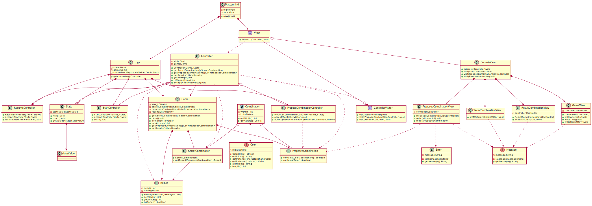

## Diseño y calidad del Software 
### Practica 2
* Fecha de entrega: 07/10/2019
* Integrantes:
  * Neo Koutsourais

   
## Diagrama MasterMind

<p align="center">
  
</p>

### PlantUML
 
 ```PlantUML
@startuml

class Mastermind {
 - logic:Logic
 - view:View
 + play():void
}
Mastermind *-down-> Logic
Mastermind *-down-> View

interface View {
 + interact(Controller):void
}
View ..> Controller

class ConsoleView {
 + interact(Controller):void
 + visit(StartController):void 
 + visit(ProposeCombinationController):void 
 + visit(ResumeController):void 
}
View <|-down- ConsoleView
ConsoleView *-down-> SecretCombinationView
ConsoleView *-down-> ProposedCombinationView
ConsoleView *-down-> ResultCombinationView
ConsoleView *-down-> GameView

class SecretCombinationView {
 + writeSecretCombination():void
}

class GameView {
 - controller:Controller
 + GameView(Controller)
 + writeAttempts():void
 + writeTitle():void
 + writeResultPlay():void
}

class ProposedCombinationView {
 - controller:Controller
 + ProposedCombinationView(Controller)
 + write(attempt:int):void
 + read():ProposedCombination
}

ProposedCombinationView ..> ProposedCombination

class ResultCombinationView {
 - controller:Controller
 + ResultCombinationView(Controller)
 + writeln(attempt:int):void
}

enum Message {
 - message:String
 - Message(message:String)
 + getMessage():String
}

SecretCombinationView ..> Message
ProposedCombinationView ..> Message
ProposedCombinationView ..> Error
ResultCombinationView ..> Message
GameView ..> Message

class Controller {
 - state:State
 - game:Game
 + Controller(Game, State)
 + getSecretCombination():SecretCombination
 + getProposedCombinations():List<ProposedCombination>
 + getResults():List<Result>
 + getAttemps():int
 + isWinner():boolean
 + {abstract} accept(ControllerVisitor):void
}
Controller ..> ProposedCombination
Controller ..> Result
Controller ..> SecretCombination
Controller <|-down- StartController
Controller <|-down- ProposeCombinationController
Controller <|-down- ResumeController

class Logic {
 - state:State
 - game:Game
 - controllers:Map<StateValue, Controller>
 + getController():Controller
}
Logic *-down-> StartController
Logic *-down-> ProposeCombinationController
Logic *-down-> ResumeController
Logic *-down-> Game
Logic *-down-> State

interface ControllerVisitor {
 + visit(StartController):void 
 + visit(ProposeCombinationController):void 
 + visit(ResumeController):void 
}

class StartController {
 + StartController(Game, State)
 + accept(ControllerVisitor):void
 + start():void
}

class ProposeCombinationController {
 + ProposeCombinationController(Game, State)
 + accept(ControllerVisitor):void
 + addProposedCombination(ProposedCombination):void
}

ProposeCombinationController ..> ProposedCombination

class ResumeController {
 + ResumeController(Game, State)
 + accept(ControllerVisitor):void
 + resume(newGame:boolean):void
}

class Game {
 - {static} MAX_LONG:int
 - secretCombination:SecretCombination
 - proposedCombinations:List<ProposedCombination>
 - results:List<Result>
 + getSecretCombination():SecretCombination
 + clear():void
 + isFinished():boolean
 + getAttemps():int
 + getProposedCombinations():List<ProposedCombination>
 + getResults():List<Result>
}
Game *--> ProposedCombination
Game *--> Result
Game *--> SecretCombination

class State {
 - stateValue:StateValue
 + next():void
 + reset():void
 + getValueState():StateValue
}
State *--> stateValue

ControllerVisitor <|-down- View
Controller ..> ControllerVisitor

Controller --> Game
Controller --> State

abstract class Combination{
  - {static} WIDTH : int
  - List<Color>
  + {static} getWidth() : int
  + getColors() : Color[]
}

enum Color{
   - initial : string
   - Color(initial : string)
   + getInitial() : string
   + {static} getInstance(character:char) : Color
   + {static} getInstance(code:int) : Color
   + {static} allInitials() : string
   + {static} length() : int
}

Combination *--> Color

class SecretCombination{
 + SecretCombination()
 + getResult(ProposedCombination) : Result 
}

SecretCombination --> Result

class ProposedCombination{
 + contains(Color, position:int) : boolean
 + contains(Color) : boolean
}

Combination <|-down- SecretCombination
Combination <|-down- ProposedCombination

class Result{
 - deads : int
 - damaged : int
 + Result(deads : int, damaged : int)
 + getBlacks() : int
 + getWhites() : int
 + isWinner() : boolean
}

class Error {
  - message:String
  - Error(message:String)
  + getMessage():String
}

@enduml


```
